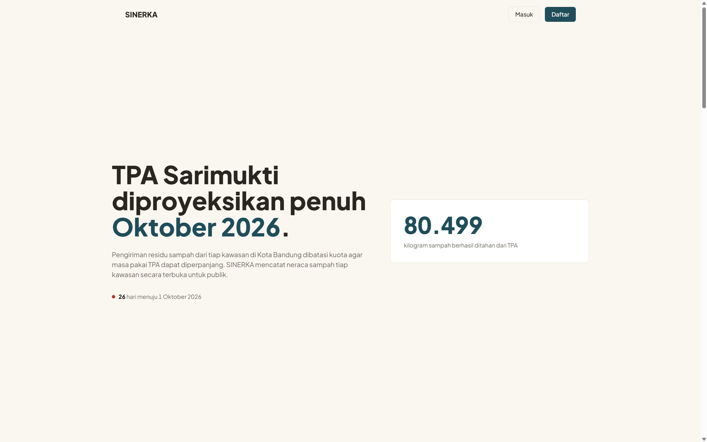
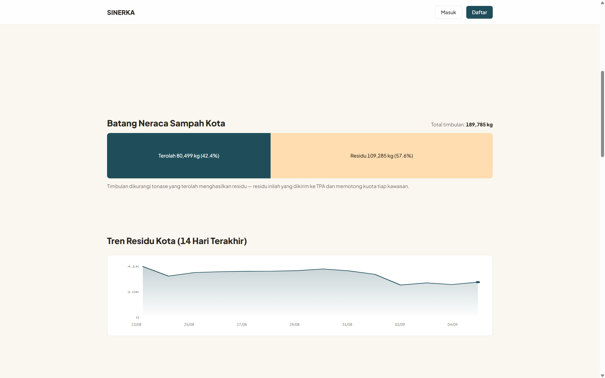
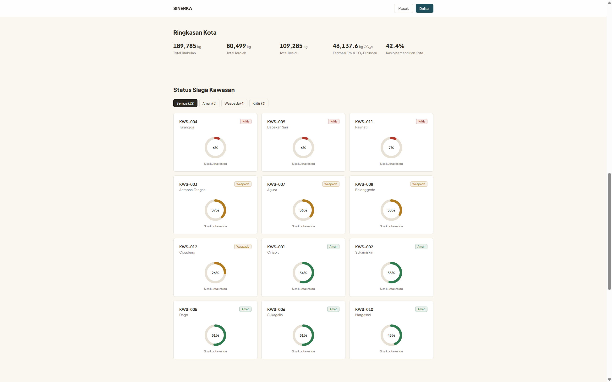
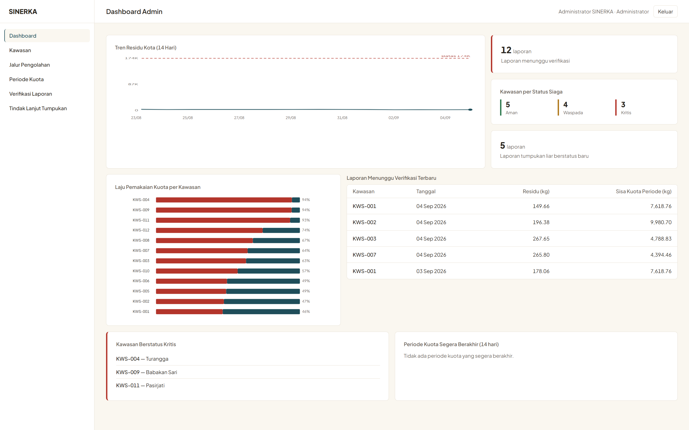
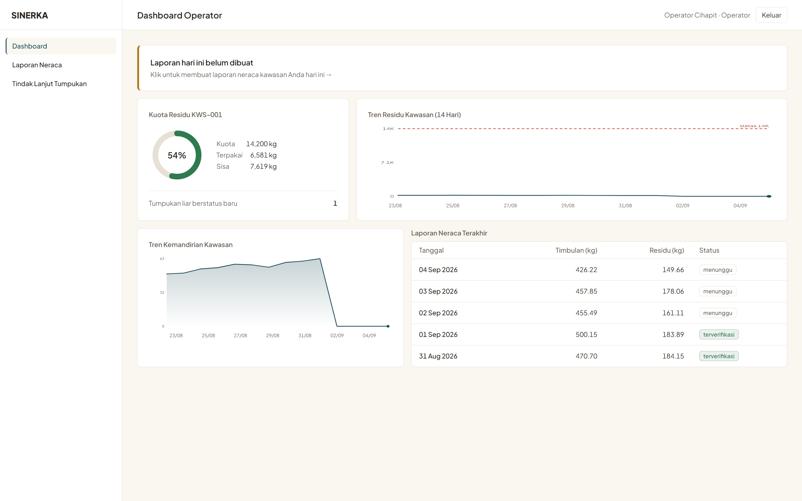
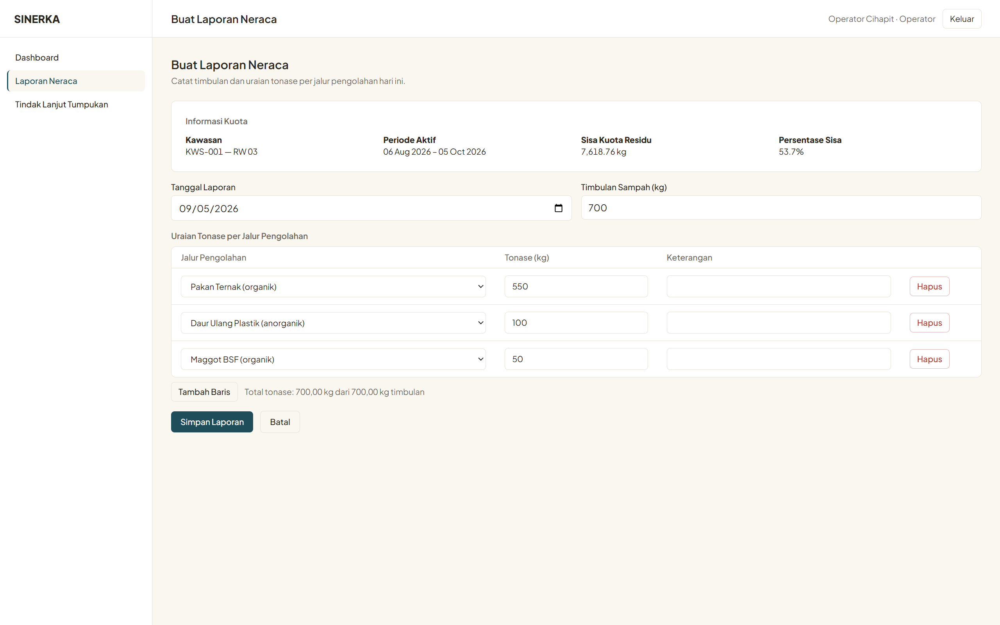
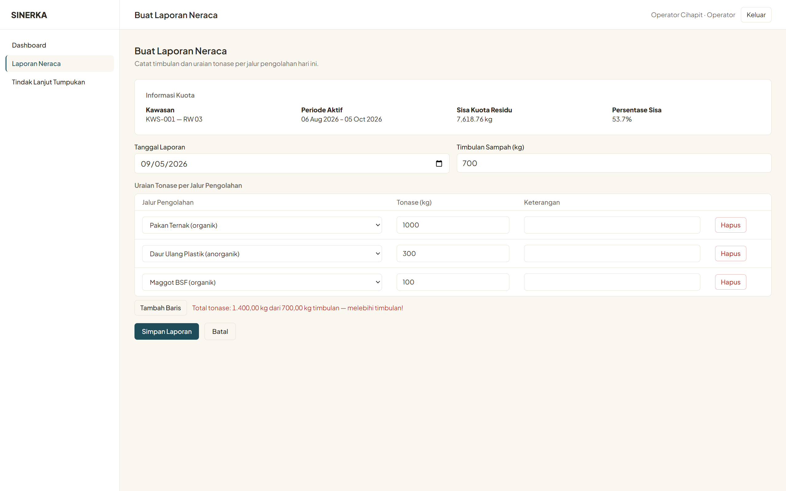

# SINERKA

**Sistem Informasi Neraca Sampah Kawasan**

Instrumen pengukuran dan pengendalian kuota residu sampah tingkat kawasan untuk Kota Bandung.

`Laravel 12` · `PHP 8.2` · `MySQL / MariaDB` · `Tailwind CSS 3` · `SDG 11`

---

## Daftar Isi

1. [Ringkasan](#1-ringkasan)
2. [Latar Belakang Masalah](#2-latar-belakang-masalah)
3. [Keterkaitan dengan SDG 11](#3-keterkaitan-dengan-sdg-11)
4. [Konsep Inti Sistem](#4-konsep-inti-sistem)
5. [Peran Pengguna dan Fitur](#5-peran-pengguna-dan-fitur)
6. [Arsitektur dan Teknologi](#6-arsitektur-dan-teknologi)
7. [Skema Basis Data](#7-skema-basis-data)
8. [Aturan Bisnis](#8-aturan-bisnis)
9. [Instalasi](#9-instalasi)
10. [Akun Demo](#10-akun-demo)
11. [Skenario Demo yang Disarankan](#11-skenario-demo-yang-disarankan)
12. [Struktur Proyek](#12-struktur-proyek)
13. [Dokumentasi Perancangan](#13-dokumentasi-perancangan)
14. [Kepatuhan terhadap Ketentuan Penugasan](#14-kepatuhan-terhadap-ketentuan-penugasan)
15. [Keterbatasan dan Pengembangan Lanjutan](#15-keterbatasan-dan-pengembangan-lanjutan)
16. [Informasi Penyusun](#16-informasi-penyusun)

---

## 1. Ringkasan

SINERKA adalah aplikasi web yang mencatat **neraca massa sampah** pada tingkat kawasan setingkat RW, menghitung **residu** yang harus dikirim ke tempat pembuangan akhir, lalu memotongkan residu tersebut terhadap **kuota buang** yang dialokasikan untuk wilayah itu.

Keluarannya bukan sekadar laporan, melainkan **status siaga per kawasan** dan **dasar angka untuk realokasi kuota** oleh Dinas Lingkungan Hidup.



> **SINERKA bukan aplikasi bank sampah.** Bank sampah diperlakukan sebagai salah satu dari enam jalur pengolahan yang diukur, bukan sebagai keseluruhan sistem.

**Persamaan yang menjadi inti seluruh aplikasi:**

```
timbulan − Σ(tonase per jalur pengolahan) = residu
sisa kuota = kuota periode − Σ(residu terverifikasi)
status siaga = f(sisa kuota ÷ kuota periode)
```

---

## 2. Latar Belakang Masalah

Kota Bandung, Kabupaten Bandung, Kabupaten Bandung Barat, Kota Cimahi, dan Kabupaten Sumedang bertumpu pada satu tempat pembuangan akhir yang sama, yaitu **TPA Sarimukti**.

| Fakta | Sumber | Waktu |
|---|---|---|
| Kapasitas TPA Sarimukti diproyeksikan hanya bertahan hingga **Oktober 2026** | Kompas | Juni 2026 |
| Volume sampah masuk mencapai **±1.700 ton per hari**, melampaui asumsi perencanaan | Kompas | Juni 2026 |
| Pengiriman sampah tiap daerah **dibatasi dengan mekanisme kuota** | Kompas | Juni 2026 |
| Pemkot Bandung menetapkan **kondisi darurat pengendalian persampahan** | IDN Times Jabar | Mei 2026 |
| Pengangkutan dihentikan sementara setelah kuota harian habis, tiap RW diminta mengolah mandiri | Tribun Jabar | Mei 2026 |
| **Insinerator mini dilarang beroperasi** oleh Kementerian Lingkungan Hidup | detikJabar | Januari 2026 |
| Program pemilahan eksisting baru menekan **8–9%** dari total tonase tahunan | BandungBergerak | — |
| Anggaran persampahan Kota Bandung **Rp348 miliar**, termasuk **1.596 petugas pemilah** di tiap RW | Tempo | Februari 2026 |

### Rumusan masalah

Sumber daya untuk pengurangan di hulu **sudah tersedia** — petugas, bank sampah unit, anggaran, dan target kawasan bebas sampah. Yang tidak tersedia adalah **lapisan datanya**.

| # | Masalah | Dampak |
|---|---|---|
| P1 | Timbulan dan hasil pengolahan mandiri per RW tidak tercatat dalam satu neraca | Residu riil tidak diketahui; kuota dikelola tanpa pengukuran |
| P2 | Sisa kuota wilayah tidak terpantau secara berjalan | Penghentian pengangkutan terjadi mendadak, bukan diantisipasi |
| P3 | Kontribusi tiap jalur pengolahan tidak terpisah datanya | Tidak diketahui jalur mana yang layak diperbesar anggarannya |
| P4 | Klaim kemandirian wilayah tidak dapat diverifikasi dengan angka | Realokasi kuota tidak punya dasar objektif |

> **Pernyataan masalah inti:** Bandung Raya mengelola sampahnya dengan sistem kuota, tetapi tidak punya neracanya. Kuota dibagi, dihabiskan, dan pengangkutan dihentikan — semuanya tanpa satu pun angka yang menunjukkan berapa ton yang sebenarnya berhasil ditahan di hulu, oleh wilayah mana, dan lewat jalur apa.

---

## 3. Keterkaitan dengan SDG 11

**SDG 11 — Sustainable Cities and Communities**

| Target | Keterkaitan |
|---|---|
| **11.6** Mengurangi dampak lingkungan kota per kapita, khususnya pengelolaan sampah kota | Kontribusi langsung: sistem mengukur tonase yang dialihkan dari TPA |
| **11.6.1** Proporsi sampah kota yang dikumpulkan dan dikelola di fasilitas terkendali | SINERKA menghasilkan angka numerator indikator ini per kawasan, terpisah per jalur |
| **11.3** Perencanaan permukiman yang partisipatif dan terintegrasi | Data dari tingkat RW menjadi masukan keputusan tingkat kota |
| **11.b** Kebijakan terpadu menuju ketahanan dan mitigasi risiko | Status siaga kawasan berfungsi sebagai sistem peringatan dini krisis sampah |

---

## 4. Konsep Inti Sistem

### 4.1 Neraca massa

Setiap hari, operator kawasan mencatat **timbulan** sampah wilayahnya, lalu menguraikan berapa tonase yang berhasil dialihkan ke tiap **jalur pengolahan mandiri**. Selisihnya adalah **residu** yang harus dikirim ke TPA.

Sistem menolak laporan yang tidak masuk akal secara fisika, yaitu ketika total tonase olahan melebihi timbulan yang dilaporkan.

### 4.2 Pengendalian kuota

Setiap kawasan memperoleh **kuota residu** untuk satu periode. Kuota berkurang hanya oleh laporan yang telah **diverifikasi admin**, bukan oleh laporan yang baru diajukan.

### 4.3 Status siaga

| Persentase sisa kuota | Status | Indikator |
|---|---|---|
| Di atas 40% | **Aman** | Hijau |
| 15% sampai 40% | **Waspada** | Kuning |
| Di bawah 15% | **Kritis** | Merah |

Status dihitung ulang setiap kali laporan diverifikasi atau kuota direalokasi, lalu disimpan ke kolom `kawasan.status_siaga`.

### 4.4 Tiga jenis kegagalan yang berbeda konsekuensinya

Pembeda utama sistem ini adalah bahwa kegagalan **tidak diperlakukan seragam**:

| Jenis | Contoh | Perlakuan sistem |
|---|---|---|
| **Pelanggaran fisika** | Total tonase olahan melebihi timbulan | Data **tidak disimpan sama sekali**; formulir dikembalikan beserta masukan sebelumnya |
| **Pelanggaran kebijakan** | Residu melampaui sisa kuota | Data **tetap disimpan** sebagai fakta lapangan, berstatus ditolak, sisa kuota tidak berkurang, dan kawasan ditandai **kritis** |
| **Pelanggaran keadaan sistem** | Periode kuota sudah ditutup | Formulir tidak dapat diakses; tombol dinonaktifkan disertai keterangan |

Residu yang melampaui kuota adalah **sinyal krisis yang harus tercatat**, bukan kesalahan input yang perlu dibuang. Inilah alasan perlakuannya berbeda dari pelanggaran fisika.

---

## 5. Peran Pengguna dan Fitur

### Pengunjung (tanpa autentikasi)

- Halaman publik berisi neraca sampah kota
- Batang neraca timbulan terhadap residu
- Grafik tren residu kota 14 hari terakhir
- Kartu status siaga seluruh kawasan beserta cincin sisa kuota, dilengkapi penyaring status
- Komposisi kontribusi tiap jalur pengolahan
- Peringkat kemandirian kawasan
- Registrasi akun warga

### Warga

- Melaporkan titik tumpukan sampah liar disertai unggahan foto
- Memantau status tindak lanjut laporannya
- Melihat status siaga dan sisa kuota kawasan tempat tinggalnya
- Grafik tren kemandirian kawasannya

### Operator Kawasan

- **Mencatat laporan neraca harian** dengan uraian tonase ke banyak jalur pengolahan sekaligus
- Penghitung total tonase berjalan yang memperingatkan sebelum melebihi timbulan
- Papan kuota kawasan berisi kuota periode, terpakai, sisa, dan persentase
- Grafik tren residu kawasan dengan garis batas kuota
- Peringatan otomatis ketika sisa kuota di bawah 40%
- Riwayat dan rincian laporan neraca kawasannya
- Menindaklanjuti laporan tumpukan liar dari warga di kawasannya

### Admin Dinas Lingkungan Hidup

- **Memverifikasi atau menolak laporan neraca** yang diajukan operator
- Mengelola data kawasan
- Mengelola jalur pengolahan beserta faktor emisi dan ikonnya
- Menetapkan dan menutup periode kuota
- Merealokasi kuota antar kawasan
- Dashboard agregat berisi tren residu kota, laju pemakaian kuota per kawasan, dan antrean verifikasi
- Menindaklanjuti seluruh laporan tumpukan liar

---

## 6. Arsitektur dan Teknologi

### 6.1 Tumpukan teknologi

| Lapisan | Teknologi | Catatan |
|---|---|---|
| Framework | Laravel 12 | Slim skeleton, tanpa `app/Http/Kernel.php` |
| Bahasa | PHP 8.2 | |
| Basis data | MySQL 8 / MariaDB 10.4 | Diuji pada MariaDB 10.4 (XAMPP) |
| Templating | Blade | Tanpa Livewire, Inertia, maupun SPA framework |
| Gaya | Tailwind CSS 3 lewat CLI | Menghasilkan CSS statis; **tanpa Vite** |
| Grafik | SVG buatan sendiri | Tanpa pustaka chart apa pun |
| Skrip | JavaScript vanilla | Tanpa jQuery, Alpine, maupun pustaka lain |
| Font | Plus Jakarta Sans | Disimpan lokal di `public/fonts/` |

### 6.2 Autentikasi ditulis manual

Autentikasi **tidak** memakai Laravel Breeze, Jetstream, maupun Fortify. Seluruhnya ditulis tangan menggunakan `Auth::attempt()` dan `Hash::make()`:

- `app/Http/Controllers/Auth/LoginController.php`
- `app/Http/Controllers/Auth/RegisterController.php`
- `app/Http/Middleware/RoleMiddleware.php`

Alias middleware `role` didaftarkan pada `bootstrap/app.php` sesuai struktur Laravel 12.

### 6.3 Pembatasan akses berbasis peran

Pembatasan ditegakkan di **sisi server**, bukan dengan menyembunyikan menu. Pengguna yang mengetik URL di luar kewenangannya akan menerima **HTTP 403**.

```php
Route::middleware(['auth', 'role:admin'])->prefix('admin')->name('admin.')->group(...);
Route::middleware(['auth', 'role:operator'])->prefix('operator')->name('operator.')->group(...);
Route::middleware(['auth', 'role:warga'])->prefix('warga')->name('warga.')->group(...);
Route::middleware(['auth', 'role:operator,admin'])->prefix('tindak-lanjut')->group(...);
```

### 6.4 Satu sumber perhitungan

Seluruh angka agregat berasal dari satu kelas, `app/Support/NeracaStat.php`, yang dipanggil baik oleh halaman publik maupun dashboard peran. Dengan demikian **tidak mungkin ada angka yang berbeda antar halaman**.

Seluruh perhitungan dijalankan langsung terhadap basis data pada setiap permintaan, tanpa cache, sehingga angka selalu mencerminkan keadaan terkini.

### 6.5 Integritas transaksi

Penyimpanan laporan neraca beserta seluruh baris uraiannya, serta proses verifikasi yang mengubah status laporan dan status siaga kawasan, dibungkus `DB::transaction()`.

---

## 7. Skema Basis Data

### 7.1 Tabel

| Tabel | Keterangan |
|---|---|
| `users` | Pengguna beserta `role`, `no_hp`, dan `kawasan_id` |
| `kawasan` | Unit wilayah setingkat RW beserta `status_siaga` |
| `periode_kuota` | Jatah residu sebuah kawasan pada satu rentang waktu |
| `jalur_pengolahan` | Data induk jalur pengolahan mandiri beserta faktor emisi |
| `laporan_neraca` | Neraca sampah satu kawasan pada satu tanggal |
| `detail_pengolahan` | **Tabel pivot** berisi tonase per jalur dalam satu laporan |
| `laporan_tumpukan` | Laporan titik tumpukan liar dari warga |

> Seluruh nama tabel memakai Bahasa Indonesia dan **tidak dijamakkan**, sehingga setiap model mendeklarasikan `protected $table` secara eksplisit.

### 7.2 Relasi

**One-to-Many**

```
Kawasan       1 ──── * User
Kawasan       1 ──── * PeriodeKuota
Kawasan       1 ──── * LaporanNeraca
Kawasan       1 ──── * LaporanTumpukan
PeriodeKuota  1 ──── * LaporanNeraca
User          1 ──── * LaporanNeraca      (sebagai operator)
User          1 ──── * LaporanTumpukan    (sebagai pelapor)
```

**Many-to-Many dengan atribut pada pivot**

```
LaporanNeraca  1..* ──── 1..*  JalurPengolahan
                     │
              detail_pengolahan
              ├─ tonase_kg
              ├─ faktor_emisi_saat_lapor
              └─ keterangan
```

Satu laporan terurai ke banyak jalur pengolahan, dan satu jalur menerima tonase dari banyak laporan. Kolom `tonase_kg` adalah atribut milik **relasinya**, bukan milik laporan maupun jalur, sehingga tidak dapat ditempatkan di tabel manapun selain pivot. Tanpa struktur ini, pertanyaan "jalur mana yang paling efektif" tidak dapat dijawab.

### 7.3 Batasan pada tingkat basis data

| Batasan | Tabel | Tujuan |
|---|---|---|
| `unique(kode_kawasan)` | `kawasan` | Kode kawasan tidak boleh ganda |
| `unique(nama)` | `jalur_pengolahan` | Nama jalur tidak boleh ganda |
| `unique(kawasan_id, tanggal_laporan)` | `laporan_neraca` | Satu kawasan hanya boleh punya satu laporan per tanggal |
| `unique(laporan_neraca_id, jalur_pengolahan_id)` | `detail_pengolahan` | Satu jalur tidak boleh muncul dua kali dalam satu laporan |

Aturan laporan ganda ditegakkan **di tingkat basis data**, bukan hanya di validasi PHP. Validasi dapat terlewat karena bug; batasan basis data tidak.

### 7.4 Perilaku penghapusan

| Relasi | Perilaku | Alasan |
|---|---|---|
| `users.kawasan_id` | `nullOnDelete` | Relasi pengguna ke kawasan adalah **penugasan**, bukan kepemilikan. Menghapus kawasan cukup melepas penugasannya |
| Relasi lainnya | `cascadeOnDelete` | Laporan memang milik kawasan |

Selain itu, **kawasan yang sudah memiliki periode kuota atau laporan neraca tidak dapat dihapus**. Constraint basis data mengatur *bagaimana* penghapusan menyebar, tetapi *apakah* penghapusan boleh terjadi adalah keputusan aturan bisnis.

### 7.5 Snapshot faktor emisi

Kolom `faktor_emisi_saat_lapor` pada pivot menyimpan nilai faktor emisi **pada saat pelaporan**, bukan merujuk ke data induk.

Prinsipnya sama dengan harga pada faktur penjualan: jika admin memperbarui faktor emisi tahun depan, laporan tahun ini tidak boleh ikut berubah nilainya, karena laporan itu sudah dipakai sebagai dasar keputusan.

---

## 8. Aturan Bisnis

| ID | Aturan |
|---|---|
| BR-01 | Akun admin tidak dapat dibuat lewat registrasi; hanya melalui seeder |
| BR-02 | Registrasi publik hanya menghasilkan akun berperan `warga`; nilai peran tidak pernah diambil dari permintaan |
| BR-03 | Akun operator dibuat admin dan wajib terikat pada tepat satu kawasan |
| BR-04 | Operator hanya dapat melaporkan dan melihat data kawasan yang menjadi tanggung jawabnya |
| BR-05 | `total_diolah_kg` adalah jumlah seluruh `tonase_kg` pada baris uraian |
| BR-06 | `total_diolah_kg` tidak boleh melebihi `timbulan_kg` |
| BR-07 | `residu_kg` dihitung sistem sebagai `timbulan_kg − total_diolah_kg`, tidak diinput manual |
| BR-08 | Satu kawasan hanya boleh memiliki satu laporan neraca per tanggal |
| BR-09 | Laporan hanya dapat dibuat pada periode kuota berstatus aktif |
| BR-10 | Sisa kuota hanya berkurang oleh laporan berstatus terverifikasi |
| BR-11 | Jika residu melampaui sisa kuota, laporan berstatus ditolak dan kawasan menjadi kritis |
| BR-12 | Satu kawasan tidak boleh memiliki dua periode kuota aktif yang rentang tanggalnya tumpang tindih |
| BR-13 | Periode tidak dapat ditutup selama masih ada laporan berstatus menunggu |
| BR-14 | Faktor emisi disimpan sebagai snapshot pada pivot |
| BR-15 | Realokasi kuota hanya boleh mengurangi kuota kawasan berstatus aman |
| BR-16 | Estimasi emisi dihitung dari laporan terverifikasi saja |
| BR-17 | Kawasan yang sudah memiliki periode kuota atau laporan neraca tidak dapat dihapus |

---

## 9. Instalasi

### 9.1 Prasyarat

- PHP 8.2 atau lebih baru, dengan ekstensi `pdo_mysql`, `mbstring`, `fileinfo`, dan `gd`
- Composer 2
- MySQL 8 atau MariaDB 10.4
- Node.js **hanya diperlukan bila ingin membangun ulang CSS**. Berkas hasil build sudah disertakan di `public/css/app.css`, sehingga aplikasi dapat langsung dijalankan tanpa Node.

### 9.2 Langkah

```bash
# 1. Klon repositori
git clone https://github.com/ramirezzServer/REPO_Faris-Yahya-Ayyash-Alfatih_Rekrutmen_EISD.git
cd REPO_Faris-Yahya-Ayyash-Alfatih_Rekrutmen_EISD

# 2. Pasang dependensi PHP
composer install

# 3. Siapkan berkas lingkungan
cp .env.example .env
php artisan key:generate

# 4. Buat basis data kosong bernama "sinerka", lalu sesuaikan .env
#    DB_DATABASE=sinerka
#    DB_USERNAME=root
#    DB_PASSWORD=

# 5. Jalankan migrasi beserta data contoh
php artisan migrate:fresh --seed

# 6. Buat tautan simbolik penyimpanan publik (untuk foto unggahan)
php artisan storage:link

# 7. Jalankan aplikasi
php artisan serve
```

Buka `http://127.0.0.1:8000`.

### 9.3 Membangun ulang CSS (opsional)

```bash
npm install
npm run build:css      # menghasilkan public/css/app.css
npm run watch:css      # mode pantau saat pengembangan
```

Proyek ini memakai **Tailwind CLI**, bukan Vite. Tidak ada direktif `@vite` di manapun, dan aplikasi tidak bergantung pada proses build saat dijalankan.

### 9.4 Catatan penting mengenai data contoh

Data contoh dibuat **relatif terhadap tanggal saat seeder dijalankan** — 30 hari terakhir terhitung dari hari itu.

Jalankan ulang `php artisan migrate:fresh --seed` bila grafik tren terlihat kosong di bagian kanan, karena artinya data contoh sudah dibuat beberapa hari sebelumnya.

---

## 10. Akun Demo

Seluruh akun memakai kata sandi **`password`**.

| Peran | Surel | Kawasan | Keterangan |
|---|---|---|---|
| Admin DLH | `admin@sinerka.test` | — | Akses penuh |
| Operator | `operator1@sinerka.test` | KWS-001 | **Belum melapor hari ini** |
| Operator | `operator2@sinerka.test` | KWS-002 | **Belum melapor hari ini** |
| Operator | `operator3@sinerka.test` | KWS-003 | **Belum melapor hari ini** |
| Operator | `operator.kws005@sinerka.test` | KWS-005 | Sudah melapor hari ini |
| Operator | `operator.kws0XX@sinerka.test` | KWS-004 s.d. KWS-012 | Pola sama untuk tiap kawasan |
| Warga | `warga1@sinerka.test` | KWS-001 | Memiliki laporan tumpukan |
| Warga | `warga2@sinerka.test` | KWS-004 | |
| Warga | `warga4@sinerka.test` | — | **Tanpa kawasan**, untuk menguji penolakan |
| Warga | `warga.kws0XX@sinerka.test` | KWS-005 s.d. KWS-012 | Pola sama untuk tiap kawasan |

Empat kawasan yang sengaja **belum melapor hari ini** adalah KWS-001, KWS-002, KWS-003, dan KWS-007, sehingga peringatan "belum lapor hari ini" pada dashboard operator dapat diperagakan.

### Gambaran data contoh

| | |
|---|---|
| Jumlah kawasan | 12, tersebar di 12 kecamatan Kota Bandung |
| Riwayat laporan | 30 hari per kawasan |
| Sebaran status siaga | 5 aman, 4 waspada, 3 kritis |
| Jalur pengolahan | 6 jalur (Maggot BSF, Komposting, Bank Sampah, Pakan Ternak, TPS3R, Daur Ulang Plastik) |
| Laporan tumpukan liar | 12 laporan dengan status beragam |

Skala data dikalibrasi dari kondisi nyata Kota Bandung, yaitu sekitar 1.500 ton timbulan per hari dengan kuota kirim ke TPA sekitar 980 ton per hari, diturunkan ke tingkat RW dengan asumsi 150 sampai 350 kepala keluarga dan sekitar 2,5 kilogram per keluarga per hari.

---

## 11. Skenario Demo yang Disarankan

Urutan ini memperagakan seluruh alur inti sistem dalam sekitar lima menit.

**1 — Halaman publik**
Buka `/` tanpa login. Perhatikan batang neraca, tren residu kota, dan kartu kawasan dengan tiga status siaga berbeda. Coba penyaring status.

**2 — Operator membuat laporan**
Masuk sebagai `operator1@sinerka.test`. Dashboard menampilkan peringatan belum melapor hari ini. Buat laporan baru, isi timbulan, tambahkan beberapa baris jalur pengolahan, dan perhatikan penghitung total tonase berjalan.

**3 — Pelanggaran fisika**
Isi total tonase melebihi timbulan, lalu simpan. Sistem menolak, tidak menyimpan apa pun, dan seluruh isian dikembalikan.

**4 — Admin memverifikasi**
Masuk sebagai `admin@sinerka.test`, buka antrean verifikasi, lalu setujui laporan tersebut. Sisa kuota berkurang dan status siaga kawasan dihitung ulang.

**5 — Pelanggaran kebijakan**
Verifikasi laporan dari kawasan yang kuotanya menipis. Laporan tetap tersimpan berstatus ditolak, kuota tidak berkurang, dan kawasan berubah menjadi kritis.

**6 — Pembatasan akses**
Masih sebagai warga atau operator, ketik `/admin/kawasan` di bilah alamat. Sistem menolak dengan HTTP 403.

**7 — Warga melaporkan tumpukan**
Masuk sebagai `warga1@sinerka.test`, unggah foto tumpukan, lalu tindak lanjuti sebagai operator kawasan yang sama.

### Tangkapan Layar

| | |
|---|---|
|  |  |
| Batang neraca dan tren residu kota pada halaman publik | Kartu status siaga kawasan beserta penyaring status |
|  |  |
| Dashboard admin berisi tren residu kota dan laju pemakaian kuota | Papan kuota dan tren residu kawasan pada dashboard operator |
|  |  |
| Pencatatan uraian tonase ke banyak jalur pengolahan | Penolakan laporan ketika total olahan melebihi timbulan |

---

## 12. Struktur Proyek

```
app/
├── Http/
│   ├── Controllers/
│   │   ├── Auth/                  LoginController, RegisterController
│   │   ├── Admin/                 Kawasan, JalurPengolahan, PeriodeKuota, VerifikasiLaporan
│   │   ├── Operator/              LaporanNeracaController
│   │   ├── Warga/                 LaporanTumpukanController
│   │   ├── DashboardController.php
│   │   └── TindakLanjutTumpukanController.php
│   └── Middleware/
│       └── RoleMiddleware.php     Pembatasan akses berbasis peran
├── Models/                        7 model Eloquent
└── Support/
    └── NeracaStat.php             Sumber tunggal seluruh angka agregat

database/
├── migrations/                    7 migrasi sesuai class diagram
└── seeders/                       Kawasan, JalurPengolahan, User, DemoLaporan

resources/
├── css/tailwind.css               Sumber gaya
└── views/
    ├── layouts/                   app (dengan sidebar), publik (landing)
    ├── components/                grafik-garis, grafik-batang, kartu-angka
    ├── dashboard/                 publik, admin, operator, warga
    ├── auth/                      login, register
    ├── admin/                     kawasan, jalur-pengolahan, periode-kuota, verifikasi-laporan
    ├── operator/                  laporan-neraca
    ├── warga/                     laporan-tumpukan
    └── tindak-lanjut/

public/
├── css/app.css                    Hasil build Tailwind, ikut versi kontrol
├── fonts/                         Plus Jakarta Sans
└── storage/                       Tautan simbolik ke unggahan

docs/                              Laporan analisis dan perancangan beserta diagram
```

---

## 13. Dokumentasi Perancangan

Seluruh dokumen dan diagram tersedia pada folder `docs/`.

| Artefak | Berkas |
|---|---|
| Laporan analisis dan perancangan | `docs/Readme_Faris Yahya Ayyash Alfatih_Rekrutmen_EISD.pdf` |
| Use Case Diagram | `docs/diagram/use-case.png` |
| Class Diagram | `docs/diagram/class-diagram.png` |
| Activity Diagram (4 fitur) | `docs/diagram/activity-*.png` |
| Sequence Diagram (4 fitur, pola ECB) | `docs/diagram/sequence-*.png` |
| Component Diagram | `docs/diagram/component.png` |
| Deployment Diagram | `docs/diagram/deployment.png` |

**Skema migrasi mengikuti Class Diagram secara utuh.** Class Diagram disusun dan dikunci terlebih dahulu, baru migrasi ditulis mengikutinya — bukan sebaliknya.

---

## 14. Kepatuhan terhadap Ketentuan Penugasan

| Ketentuan | Status | Bukti |
|---|---|---|
| Sesuai isu SDG yang diambil | ✅ | Seluruh domain produk mengacu SDG 11.6 dan 11.b |
| Wajib menggunakan framework Laravel | ✅ | Laravel 12, `composer.json` |
| Login dan register dengan batasan hak akses tiap peran | ✅ | Auth manual, `RoleMiddleware`, HTTP 403 pada akses lintas peran |
| Menerapkan relasi One-to-Many | ✅ | 7 relasi, lihat bagian 7.2 |
| Wajib Many-to-Many dengan tabel pivot | ✅ | `LaporanNeraca` ↔ `JalurPengolahan` melalui `detail_pengolahan`, dengan atribut tambahan |
| Validasi input sisi server dan flash message | ✅ | Seluruh operasi simpan, ubah, dan hapus |
| Mengikuti alur Route, Controller, Model, dan View | ✅ | Lihat struktur proyek |
| Skema migrasi 100% cocok dengan UML | ✅ | Class Diagram dikunci sebelum migrasi ditulis |
| Dilarang memakai package otomatis seperti Filament | ✅ | Tanpa Breeze, Jetstream, Fortify, Livewire, maupun Filament. Autentikasi ditulis tangan |

**Catatan mengenai Tailwind CSS.** Tailwind digunakan hanya sebagai alat pembangun CSS yang menghasilkan berkas statis `public/css/app.css`, dan berkas tersebut ikut disertakan dalam repositori. Node dan npm tidak diperlukan untuk menjalankan aplikasi, tidak ada direktif `@vite`, serta tidak ada package yang membangkitkan kode maupun antarmuka secara otomatis.

---

## 15. Keterbatasan dan Pengembangan Lanjutan

Keterbatasan berikut disadari sejak perancangan dan dicatat sebagai lingkup yang sengaja tidak dikerjakan.

| Keterbatasan | Rencana pengembangan |
|---|---|
| Angka timbulan dan tonase diinput manual, belum terhubung timbangan | Integrasi dengan timbangan digital atau perangkat IoT |
| Status siaga baru berubah setelah verifikasi, belum ada notifikasi | Pemberitahuan melalui surel atau WhatsApp saat status berubah kritis |
| Belum ada peramalan kapan kuota akan habis | Model peramalan berbasis tren pelaporan |
| Peta wilayah masih berupa daftar dan kartu | Peta geospasial interaktif dengan pewarnaan status siaga |
| Estimasi emisi bersifat indikatif | Kalibrasi faktor emisi berdasarkan pengukuran lapangan |
| Cakupan terbatas pada satu kota | Perluasan ke seluruh wilayah pelayanan TPA Sarimukti |
| Perhitungan agregat dijalankan pada setiap permintaan tanpa cache | Agregasi terjadwal bila jumlah kawasan bertambah besar |

---

## 16. Informasi Penyusun

| | |
|---|---|
| Nama | Faris Yahya Ayyash Alfatih |
| NIM | 102022400029 |
| Program Studi | S1 Sistem Informasi |
| Fakultas | Rekayasa Industri |
| Institusi | Telkom University |
| Konteks | Study Case Rekrutmen Asisten Praktikum EISD |
| Tahun | 2026 |

---

## Lisensi

Repositori ini dibuat untuk keperluan seleksi akademik. Data kondisi persampahan yang dikutip berasal dari pemberitaan media terbuka sepanjang 2026 dan dicantumkan sumbernya pada bagian 2. 
